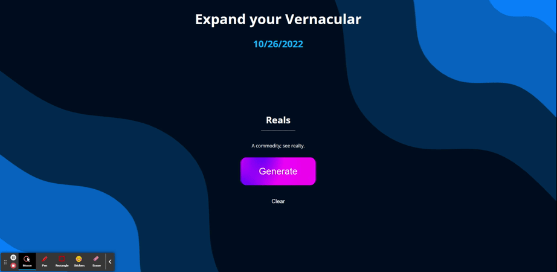
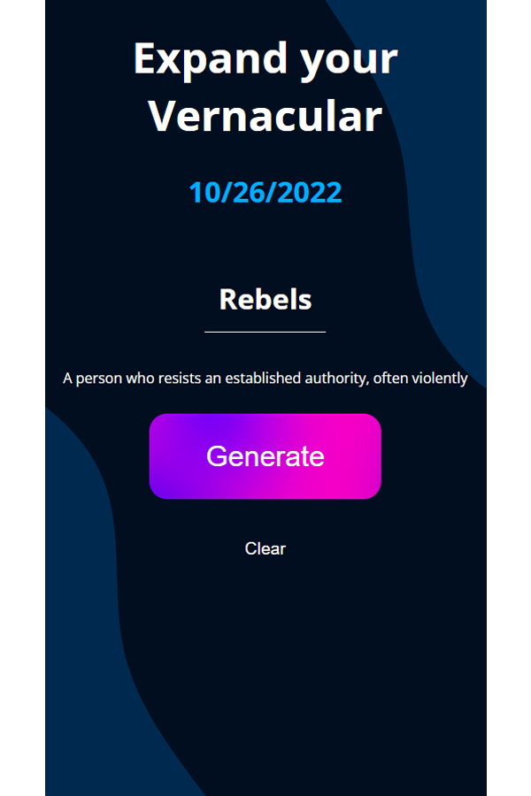

# Expand-Your-Vernacular

## Description
In this project we collaborated to create a website that allows users a unique experience in learning new words. A user is able to click the generate button and will provided a random word and its definition. The user then can choose to click the generate button and be provided another word and definition. The simple yet responsive design of the website is stream-lined for use on various screen sizes.

## Deploy link:
- https://urstupidsammy.github.io/groupProject/

In completing this project we have learned how to use a CSS framework to design a webpage. We also were able to utilize data from third-party APIs in conjuntion with javascript to create an interactive web application. 

## Mobile Design 

## Features
  
  * Immense library of words with definitions
  * Word selection is completely random
  * Correct spelling of words provided

## Future Endeavors

  * It is a future endeavor to include an audio element representing how the word is pronounced

## Tools Utilized

## Installation

In order to utilize this website, user must have access to a web browser.

## Usage

This website allows for users a chance to acquire a vast array of words to add to their vocabulary. A user just needs to click the generate button and the website will pull from a massive library of words and provide both the word and definition.

## Credits

* Samuel Galban https://github.com/Urstupidsammy
* Luke Mcilvenny  https://github.com/TDGLU
* Erick Islas https://github.com/Erick454
* Cherie Walker https://github.com/Cherie2

Resources of significance:

Special thanks to Ileriayo Adebiyi https://github.com/Ileriayo/markdown-badges#testing for his public library of common badges

## License

Please refer to the repository under LICENSE file.